# EdgeAI-MCU 期末報告

本專案為 Edge AI MCU 課程期末報告整理，內容包含課程各項實作作業、成果展示、EdgeAI MCU 可能應用設計，以及個人學習心得。課程中使用 AMB82-mini 作為主要實作平台，結合 Web Server、感測器、TFT LCD、Camera、AI Vision、TTS、GitHub Pages 等功能，練習將 AI 與嵌入式系統整合成實際可操作的應用。

GitHub Repository：https://github.com/Ka-trina/EdgeAI-MCU
GitHub Pages：https://ka-trina.github.io/EdgeAI-MCU

---

## 目錄

1. [專案簡介](#專案簡介)
2. [開發環境與使用工具](#開發環境與使用工具)
3. [作業一：智慧學習節奏助理](#作業一智慧學習節奏助理)
4. [作業二：AMB82-mini Web Server 控制雙 LED](#作業二amb82-mini-web-server-控制雙-led)
5. [作業三：Vibe Coding HTML App](#作業三vibe-coding-html-app)
6. [作業四：YOLOv7 Surveillance 物件偵測](#作業四yolov7-surveillance-物件偵測)
7. [作業五：Visual Assistant 視覺助理](#作業五visual-assistant-視覺助理)
8. [作業六：VL53L0X 紅外線距離感測與 TFT 顯示](#作業六vl53l0x-紅外線距離感測與-tft-顯示)
9. [作業七：MPU6050 Heading Angle 讀取](#作業七mpu6050-heading-angle-讀取)
10. [作業八：DHT11 溫濕度感測 Web Server](#作業八dht11-溫濕度感測-web-server)
11. [作業九：AI 看圖說故事互動系統](#作業九ai-看圖說故事互動系統)
12. [EdgeAI MCU 可能應用設計](#edgeai-mcu-可能應用設計)
13. [學習心得](#學習心得)

---

## 專案簡介

Edge AI 的核心概念，是將 AI 推論能力從雲端移動到終端裝置或嵌入式平台上，使裝置能夠在本地端完成資料感測、影像判斷、語音互動與即時控制。本課程以 AMB82-mini 為主要實作平台，讓我們從最基本的 LED 控制、網頁伺服器、感測器資料讀取開始，逐步延伸到影像辨識、AI Vision、TTS 語音輸出，以及 GitHub Pages 網頁部署。

本報告整理了課程中的九項作業，包含硬體接線、程式修改、AI 協助開發、實作結果與學習重點。整體學習過程讓我更清楚理解 Edge AI MCU 並不是單純把 AI 模型放進板子裡，而是要將感測器、網路通訊、使用者介面、AI 模型與輸出裝置整合成完整系統。

---

## 開發環境與使用工具

| 項目 | 使用內容 |
|---|---|
| 開發板 | AMB82-mini |
| 開發環境 | Arduino IDE |
| 程式語言 | Arduino C/C++、HTML、JavaScript |
| AI 工具 | ChatGPT、Gemini、Google AI Studio |
| 網頁部署 | GitHub、GitHub Pages |
| 感測器 | DHT11、VL53L0X、MPU6050 |
| 顯示模組 | TFT LCD ILI9341 |
| 影像與語音 | Camera、AI Vision、TTS |
| 通訊方式 | WiFi、Web Server、WebSocket、I2C、SPI |

---

## 作業一：智慧學習節奏助理

### 作業概念

學生在準備考試或長時間讀書時，常常會因為壓力太大而一直逼自己讀下去，但實際上可能已經開始焦慮、分心或吸收效率下降。因此本作業設計一個「智慧學習節奏助理」，透過 AI Agent 與環境感測器協助使用者調整讀書節奏。

這個裝置的目標不是監控使用者，而是像一個放在旁邊的讀書輔助工具，提醒使用者適當休息、調整環境，並在需要時提供簡單的語音互動。

### 硬體設計

| 硬體 | 功能 |
|---|---|
| AI-MCU | 執行 AI Agent、處理語音指令、分析感測器資料、控制其他硬體模組 |
| 麥克風 | 接收使用者語音指令，例如設定讀書時間或詢問問題 |
| 喇叭 | 播放提醒、休息建議或語音回覆 |
| 光線感測器 | 判斷讀書環境是否太暗 |
| 噪音感測器 | 判斷周遭是否太吵 |
| 距離感測器 | 判斷使用者是否長時間離開桌面 |

### 功能設計

1. **學習節奏管理**  
   使用者可以設定 25 分鐘或 30 分鐘的讀書時間，AI Agent 會在時間結束時提醒休息，避免長時間讀書造成壓力累積。

2. **焦慮緩和提醒**  
   如果使用者讀書時間過長，系統可以提醒起來走動、喝水或短暫休息。適當休息可以讓後續讀書效率更穩定。

3. **環境狀態提醒**  
   透過光線、噪音與距離感測器判斷讀書環境，例如光線太暗時提醒開燈，噪音太大時提醒換環境或戴耳機。

### 應用價值

這個設計可以幫助使用者建立更健康的讀書節奏，減少長時間讀書帶來的焦慮感，同時改善讀書環境。比起單純的倒數計時器，加入 AI Agent 後可以讓提醒內容更有彈性，也更接近真實的學習陪伴工具。

---

## 作業二：AMB82-mini Web Server 控制雙 LED

### 作業目標

本作業將原本的 `WebServer_ControlLED.ino` 程式修改成可以同時控制兩顆 LED 的版本。透過 AMB82-mini 建立 Web Server，手機連線後可以在瀏覽器中控制 `LED_B` 與 `LED_G` 的開關。

### 程式修改重點

原本範例只控制單一 LED，本作業加入兩組 LED 控制按鈕：

- `LED_B ON`
- `LED_B OFF`
- `LED_G ON`
- `LED_G OFF`

網頁端透過不同按鈕送出請求，AMB82-mini 接收到請求後判斷對應指令，再控制指定 LED 腳位輸出 HIGH 或 LOW。

### 實作成果

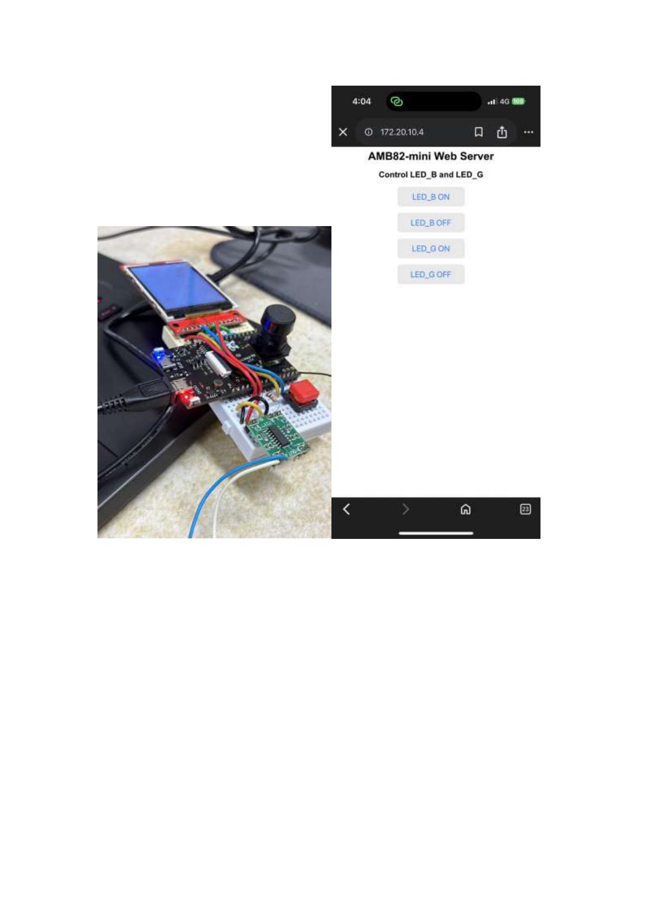

成果中可以看到手機成功連線到 AMB82-mini 的 Web Server，頁面標題為 `AMB82-mini Web Server`，並提供四個按鈕分別控制 `LED_B` 與 `LED_G`。左側實體電路照片中，也能看到 AMB82-mini 與 LED 模組實際運作。

### 學習重點

本作業讓我理解 AMB82-mini 不只能單純執行控制程式，也可以作為簡易 Web Server，讓手機或電腦透過瀏覽器控制硬體。這種方式很適合應用在簡易智慧家電、遠端開關控制或感測器資料顯示系統。

---

## 作業三：Vibe Coding HTML App

### 作業目標

本作業使用 ChatGPT 或 Google AI Studio 協助建立一個 HTML App，並嘗試將 App Hosting 到 AMB82-mini，讓手機或電腦可以連線使用。

### App 設計概念

我設計的 App 是一個遊戲風格的互動式網頁，畫面中包含角色、數值面板、操作說明與遊戲場景。透過 AI 協助產生 HTML、CSS 與 JavaScript，可以快速完成具有互動性的網頁原型。

### 實作成果

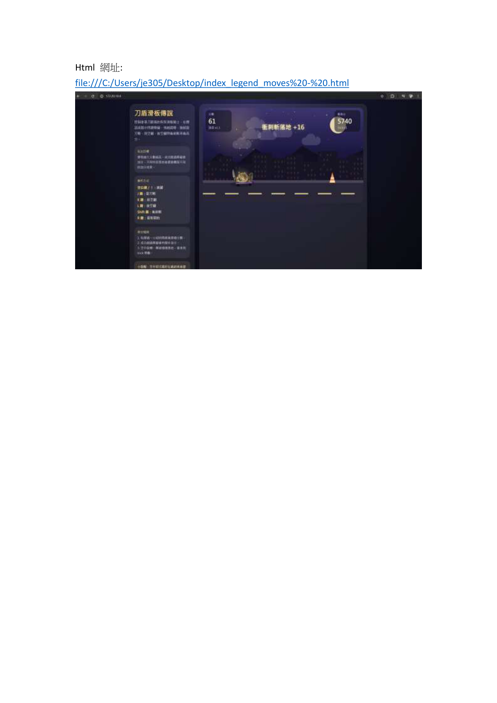

成果畫面顯示 HTML App 已可在瀏覽器中開啟，畫面左側為能力與操作資訊，右側為主要遊戲畫面。這代表 AI 輔助產生的 HTML App 已經能夠在本機端正常執行，後續也可以進一步放到 AMB82-mini 或 GitHub Pages 上展示。

### 學習重點

本作業讓我體會到 Vibe Coding 的特色，也就是先用自然語言描述想要的功能，再由 AI 產生初版程式，接著再依照執行結果逐步修改。這種方式可以降低前端開發的門檻，讓我能把更多心力放在功能設計與成果驗證上。

---

## 作業四：YOLOv7 Surveillance 物件偵測

### 作業目標

本作業使用 AMB82-mini 執行 YOLOv7 物件偵測模型，偵測類別包含：

- person
- bicycle
- car
- motorcycle
- bus
- truck

並結合 WebSocket Viewer 與 NTPClient，讓系統可以即時觀察偵測結果，並以年月日時分秒作為檔名儲存偵測圖片。

### 程式修改重點

原本範例中，記錄影像的時間限制為：

```cpp
if(hour>=0 && hour<=6) {
```

本作業將條件修改成：

```cpp
if(hour>=0) {
```

如此一來，系統不再只限制於凌晨 0 到 6 點紀錄，而是只要時間條件符合即可進行儲存，方便課堂實作時直接測試。

### 實作成果

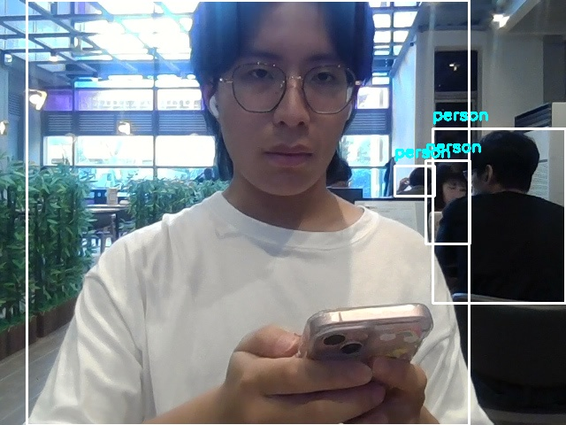

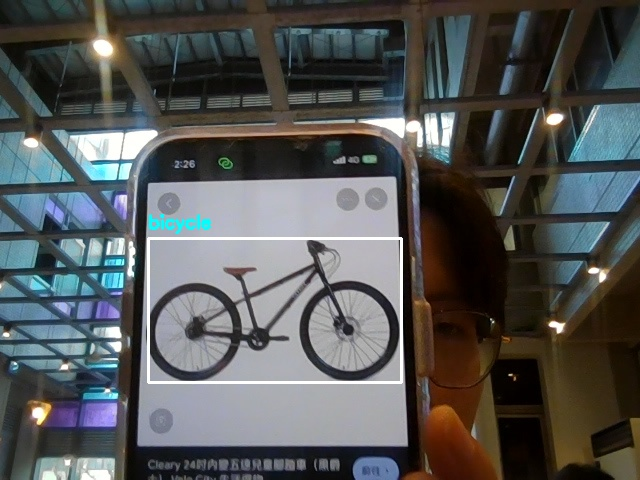

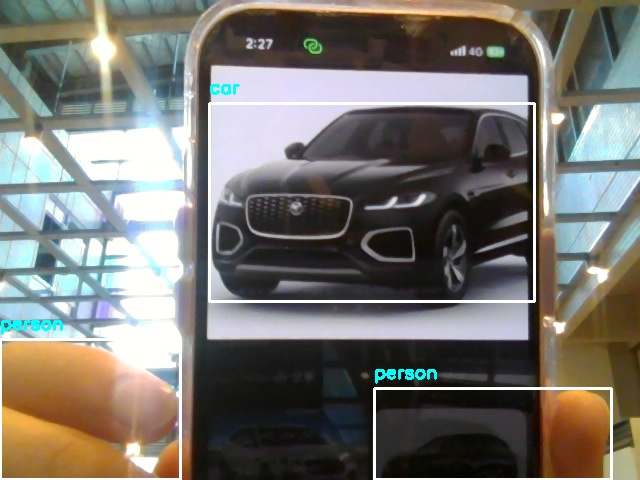

從輸出的檔名可以看到，偵測結果已經包含日期與時間，例如 `ObjDet_2026_03_30_14_22_43.jpg`，代表 NTPClient 時間命名功能有成功整合。

### 學習重點

本作業讓我了解 Edge AI 影像辨識在嵌入式平台上的基本流程。系統不只是執行模型，也需要處理即時影像串流、偵測結果顯示、時間同步與檔案儲存。這些功能整合後，才會形成一個比較完整的智慧監控雛形。

---

## 作業五：Visual Assistant 視覺助理

### 作業目標

本作業使用 GitHub Fork 範例專案 `app-visual_assistant`，並透過 GitHub Pages 發布成可執行網頁。接著使用 ChatGPT 或 Gemini 修改 `index.html`，讓介面更簡化並適合盲人或視覺不便者使用。

### GitHub Pages 建置流程

1. Fork 範例專案。
2. 進入 `Settings > Pages`。
3. Branch 選擇 `main`。
4. 按下 Save。
5. 產生 GitHub Pages 網頁。
6. 修改並上傳 `index.html`。
7. 使用手機或電腦開啟網頁測試。

### 功能說明

這個網頁式視覺助理主要功能包含：

- 輸入 OpenAI API Key
- 輸入模型名稱
- 開啟相機
- 擷取畫面
- 詢問並朗讀
- 產生畫面辨識結果

### 實作成果
GitHub 專案連結：
https://github.com/Ka-trina/app-visual_assistant?utm_source=chatgpt.com

GitHub Pages 介面連結：

https://ka-trina.github.io/app-visual_assistant/?utm_source=chatgpt.com

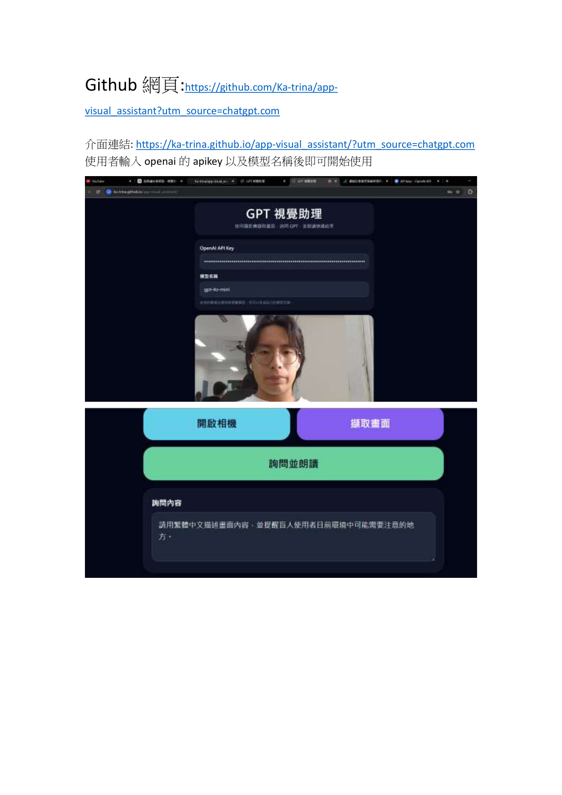

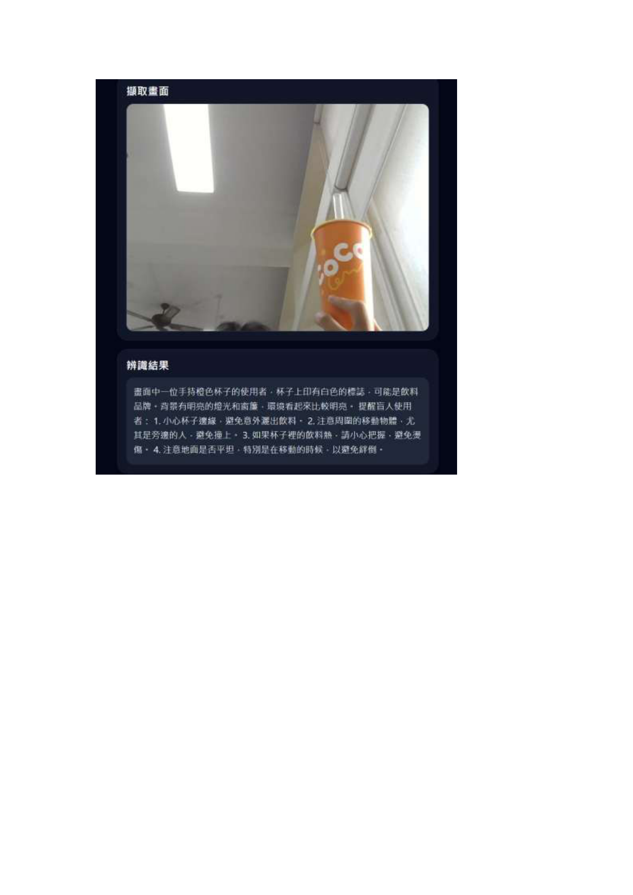

成果中可以看到網頁標題為「GPT 視覺助理」，介面提供相機畫面、擷取畫面與詢問並朗讀按鈕。測試時，系統可以針對畫面中的物品與環境產生描述，例如杯子、窗戶、光線等內容。

### 學習重點

本作業讓我學到 GitHub Pages 的基本部署流程，也理解前端網頁可以直接結合 AI API 完成實用功能。對盲人或視覺不便者來說，簡化介面非常重要，因此按鈕大小、操作流程、朗讀功能與文字描述都會影響實際使用體驗。

---

## 作業六：VL53L0X 紅外線距離感測與 TFT 顯示

### 作業目標

本作業使用 VL53L0X 紅外線距離感測器讀取距離，並將距離資料顯示在 TFT LCD 上。作業要求使用 I2C1 bus，也就是 SDA1、SCL1，並透過 `Wire1.begin()` 初始化。

### 程式修改重點

除了在主程式中加入：

```cpp
Wire1.begin();
```

也需要修改 Realtek hardware package library 中的 `VL53L0X.cpp`，將 VL53L0X 建構式中的 bus 改成：

```cpp
VL53L0X::VL53L0X():
    bus(&Wire1),
```

這樣感測器才會使用 AMB82-mini 的 I2C1 腳位，而不是預設的 I2C bus。

### 實作成果

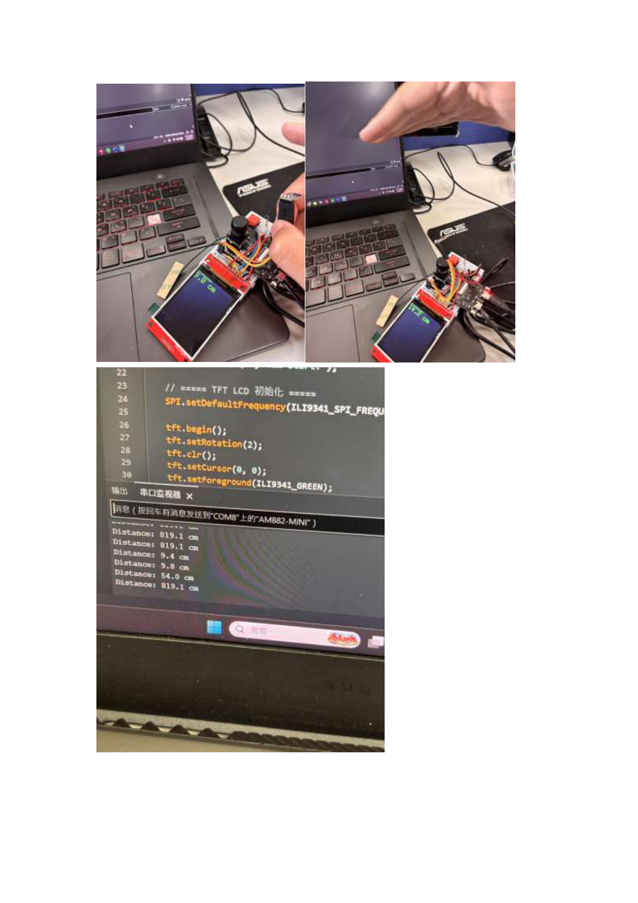

成果中可以看到 AMB82-mini 連接 VL53L0X 感測器與 TFT LCD。當手靠近感測器時，距離數值會變化，序列監控視窗與 TFT LCD 也會顯示對應的距離資料，單位為 cm。

### 學習重點

本作業讓我理解在嵌入式系統中，感測器能不能正常工作不只和程式邏輯有關，也和通訊介面設定有關。特別是 I2C 匯流排有不同組腳位時，若函式庫仍使用預設 bus，就會造成感測器無法讀取。因此修改函式庫與正確初始化 `Wire1` 是本作業的關鍵。

---

## 作業七：MPU6050 Heading Angle 讀取

### 作業目標

本作業使用 MPU6050 感測器取得 heading angle，透過 `MPU6050_DMP6_GetHeading.ino` 程式讀取感測器姿態資料，並在序列監控視窗中觀察方向角變化。

### 功能說明

MPU6050 是一顆常見的 IMU 感測器，內部包含加速度計與陀螺儀，可用於偵測姿態、旋轉與方向變化。透過 DMP 功能，可以將原始感測資料轉換成較容易使用的角度資訊。

### 實作成果

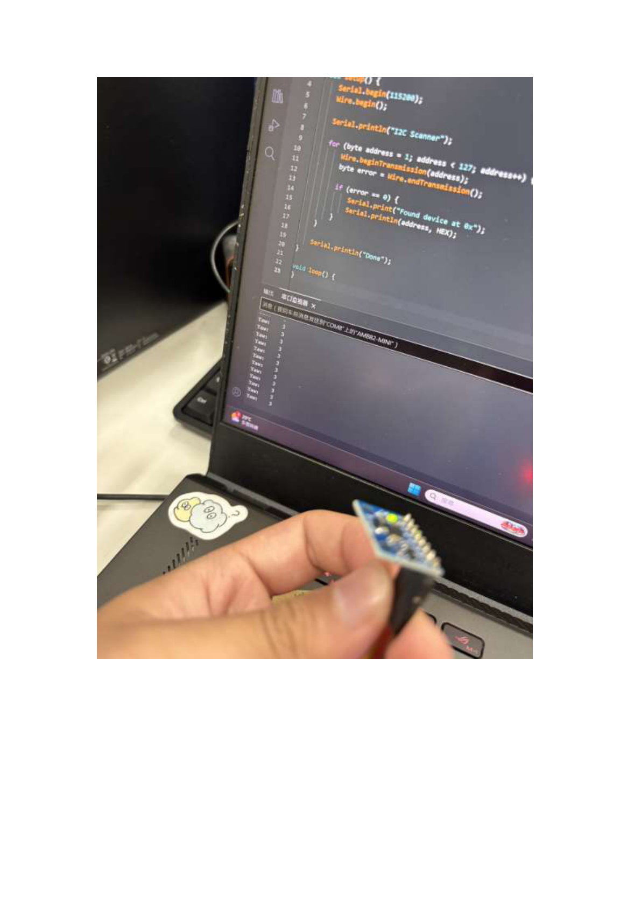

成果中可以看到手持 MPU6050 感測器，並在電腦的序列監控視窗中觀察輸出數值。當感測器方向改變時，輸出數值也會跟著變化，代表 heading angle 讀取功能已成功運作。

### 學習重點

本作業讓我理解 IMU 感測器可以用來判斷裝置的姿態與方向。這類感測器未來可以應用在手勢控制、機器人方向判斷、姿態偵測、互動裝置等場景。如果搭配 Edge AI，也可以進一步做動作分類或異常動作偵測。

---

## 作業八：DHT11 溫濕度感測 Web Server

### 作業目標

本作業結合 DHT11 溫濕度感測器與 AMB82-mini Web Server。作業要求修改 `ReceiveData` 範例程式，使網頁可以顯示 DHT11 讀取到的溫度與濕度資料。

### 程式整合方向

使用到的範例包含：

- `Examples > AmebaGPIO > DHT_Tester`
- `Examples > WiFi > SimpleHttpWeb > ReceiveData`

整合方式是將 DHT11 感測器讀取溫濕度的部分加入 Web Server 回應內容中，讓使用者透過瀏覽器連線到 AMB82-mini 的 IP 位址後，可以直接查看即時環境資料。

### 實作成果

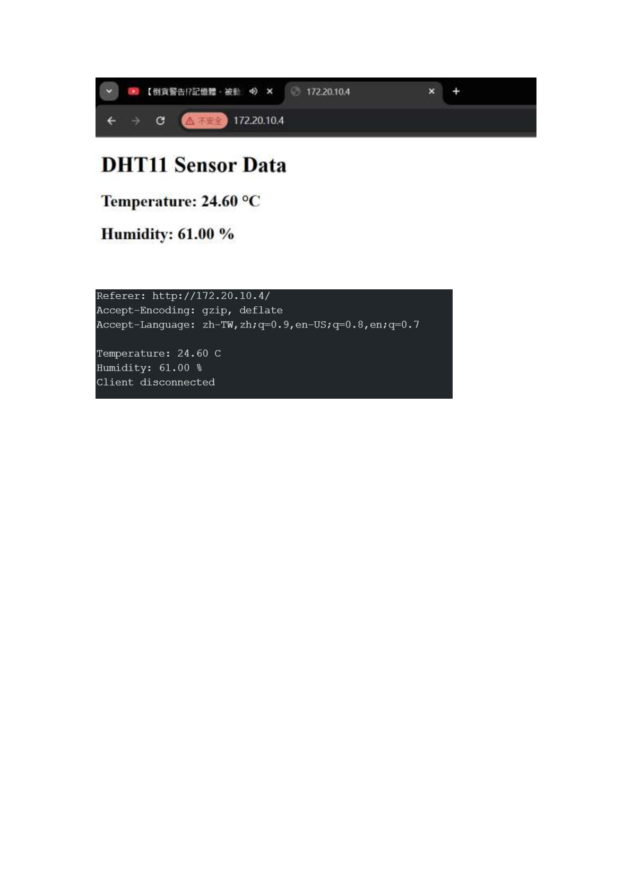

成果網頁顯示：

- Temperature: 24.60 °C
- Humidity: 61.00 %

下方序列監控視窗也同步顯示 HTTP request 資訊，以及溫度與濕度資料，代表 AMB82-mini 成功讀取 DHT11 並將資料回傳到網頁端。

### 學習重點

本作業讓我理解感測器資料可以透過 Web Server 轉換成遠端可讀取的資訊。這種架構很適合應用在智慧環境監測，例如室內溫濕度監控、農業環境感測或簡易物聯網儀表板。

---

## 作業九：AI 看圖說故事互動系統

### 作業目標

本作業要求實作任一個應用，功能需包含：

1. 拍照
2. AI Vision
3. TTS
4. LCD 顯示圖片或文字

我設計的應用為「AI 看圖說故事互動系統」。使用者按下按鈕後，系統會透過相機拍攝照片，將影像送至 Gemini Vision 分析，並自動生成一段繁體中文短故事與英文翻譯。系統會先在 LCD 顯示英文故事，再透過 TTS 播放中文故事。

### 系統流程

1. 系統啟動並連接 WiFi。
2. 初始化 TFT LCD。
3. 初始化 Camera。
4. 等待使用者按下按鈕。
5. 按下按鈕後倒數 3 秒，並閃爍 LED_B。
6. 拍攝照片。
7. 將影像傳送給 Gemini Vision。
8. AI 依照圖片內容生成中英文故事。
9. LCD 顯示英文故事。
10. 中文故事透過 TTS 轉成 MP3。
11. 播放語音故事。
12. 完成後等待下一次按鈕觸發。

### Prompt 設計

```cpp
String prompt_msg =
"請根據這張圖片創作一段約 50 字的繁體中文短故事，"
"再提供一段簡短英文翻譯。"
"請嚴格使用以下格式輸出："
"CN:中文故事"
"EN:English translation";
```

這個 prompt 要求 AI 使用固定格式輸出，讓程式可以透過 `CN:` 與 `EN:` 將中文故事和英文翻譯分開。中文故事用於 TTS 播放，英文翻譯則顯示在 TFT LCD 上。

### 實作成果
https://youtube.com/shorts/89vE1KZBm-Y?feature=share

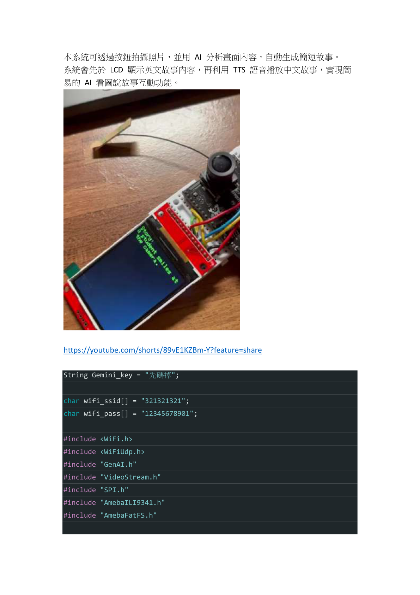

成果影片：`https://youtube.com/shorts/89vE1KZBm-Y?feature=share`

成果中可以看到 AMB82-mini 搭配 Camera、TFT LCD 與按鈕完成互動流程。LCD 會顯示 AI 產生的英文故事內容，而中文故事則透過 TTS 轉成語音播放。

### 程式重點

```cpp
Camera.getImage(CHANNEL, &img_addr, &img_len);

String aiText = llm.geminivision(
    Gemini_key,
    "gemini-2.0-flash",
    prompt_msg,
    img_addr,
    img_len,
    client
);

String cn_story = getCNText(aiText);
String en_story = getENText(aiText);

tft.println("Story:");
tft.println(en_story);

tts.googletts(mp3Filename, cn_story, "zh-TW");
sdPlayMP3(mp3Filename);
```

### 學習重點

這是我認為最完整的一項整合型作業，因為它不只是單一感測器或單一網頁功能，而是把按鈕、LED、相機、WiFi、AI Vision、LCD 顯示與 TTS 語音全部串在一起。透過這次實作，我更明白 Edge AI 系統需要考慮完整流程，包括輸入、AI 分析、資料解析、顯示與輸出回饋。

---

## EdgeAI MCU 可能應用設計

### 應用一：智慧學習節奏助理

此應用對應作業一的設計概念，主要目標是讓 EdgeAI MCU 成為讀書時的輔助工具。系統可以結合麥克風、喇叭、光線感測器、噪音感測器與距離感測器，判斷使用者目前的讀書狀態與環境狀況。

例如使用者可以用語音設定讀書時間，AI Agent 會在讀書時間結束時提醒休息。如果環境太暗，系統會提醒開燈；如果環境太吵，系統會建議換位置或戴耳機。這種設計的重點不是取代使用者，而是協助使用者建立健康且可持續的學習節奏。

### 應用二：智慧環境監測系統

此應用可以延伸作業八的 DHT11 Web Server。EdgeAI MCU 可以讀取溫濕度、光線、空氣品質等資料，並透過網頁或手機介面顯示即時環境狀態。若資料超過設定範圍，系統可以提醒使用者開窗、開除濕機或調整環境。

若加入 AI 分析，系統也可以根據長時間資料變化判斷環境趨勢，例如是否長期濕度過高、是否容易造成物品發霉，或是否需要改善通風。

### 應用三：AI 視覺輔助裝置

此應用可以延伸作業五與作業九。透過相機擷取畫面，再交由 AI Vision 分析，系統可以描述畫面中的物品、人物或環境狀態，並透過 TTS 將結果朗讀出來。

這類系統可應用在視覺輔助、長者照護、教育互動或兒童故事機。例如視覺不便者可以透過拍照了解眼前物體；小朋友也可以透過看圖說故事功能，讓 AI 根據圖片生成故事並朗讀。

### 應用四：智慧安全監控與事件紀錄

此應用可以延伸作業四的 YOLOv7 Surveillance。AMB82-mini 可以在本地端執行物件偵測，辨識 person、car、truck 等類別，並在偵測到特定目標時儲存影像。搭配 NTPClient 後，檔案可使用年月日時分秒命名，方便後續查詢。

與傳統監控相比，Edge AI 監控不需要把所有影像都上傳到雲端，而是可以先在本地端判斷是否需要紀錄，降低資料傳輸量，也能提高隱私性。

---

## 學習心得

這學期透過 EdgeAI MCU 的各項作業，我從一開始只是在板子上控制 LED，到後來能夠整合相機、感測器、LCD、Web Server、AI Vision 與 TTS，對嵌入式系統和 AI 應用的理解變得更完整。

以前我對 AI 的想像比較偏向在電腦或雲端上執行，例如輸入文字給模型、讓模型回答問題。但這門課讓我發現，AI 其實可以被放進實際裝置的操作流程中。像是按下按鈕後拍照、把圖片送給 AI 分析、再把結果顯示到 LCD 或用語音播放，這些流程讓 AI 從單純的聊天工具變成可以和硬體互動的系統。

我覺得這門課最重要的收穫，是理解 Edge AI MCU 的價值不只是「小板子可以跑 AI」，而是它可以把感測、運算、判斷與輸出整合在同一個裝置附近。這樣可以降低延遲，也能減少對雲端的依賴。像 DHT11 溫濕度網頁、VL53L0X 距離顯示、MPU6050 方向角讀取，都讓我熟悉了感測器資料如何進入系統；而 YOLOv7、Visual Assistant、AI 看圖說故事，則讓我理解 AI 可以如何處理影像與語音互動。

在實作過程中，我也學到 AI 工具對寫程式很有幫助，但不能完全只依賴 AI。AI 可以幫忙改程式、整理邏輯、產生 HTML 或 README，但實際接線、燒錄、測試、Debug，還是需要自己理解每一段程式在做什麼。尤其是像 I2C bus、TFT LCD、WiFi 連線、API Key、TTS 檔案播放這些問題，如果只看 AI 給的程式，遇到錯誤時還是很難修。因此我認為這門課讓我學到的不只是技術，也包含如何和 AI 協作完成實作。

最後，這份期末報告整理了整學期的實作成果。雖然每一項作業看起來是獨立的，但其實它們可以組合成更大的系統。例如感測器可以提供環境資料，Web Server 可以提供遠端介面，Camera 可以提供影像輸入，AI Vision 可以理解畫面，TTS 可以提供語音輸出。這些模組若整合在一起，就能做出智慧助理、環境監測、視覺輔助或智慧監控等應用。透過這次整理，我更清楚知道 Edge AI MCU 的應用方向，也對未來把 AI 和硬體結合的專題更有概念。

---

## 專案資料夾結構

```text
EdgeAI-MCU/
├── README.md
├── images/
│   ├── hw02_webserver_led.png
│   ├── hw03_html_app.png
│   ├── ObjDet_2026_03_30_14_22_43.jpg
│   ├── ObjDet_2026_03_30_14_26_29.jpg
│   ├── ObjDet_2026_03_30_14_27_13.jpg
│   ├── hw05_visual_assistant_p1.png
│   ├── hw05_visual_assistant_p2.png
│   ├── hw06_vl53l0x_tft.png
│   ├── hw07_mpu6050_p1.png
│   ├── hw08_dht11_web.png
│   └── hw09_ai_story_p1.png
├── src/
│   └── README.md
└── docs/
    └── 作業原始 PDF 與補充資料
```

---

## 結論

本次期末報告將課程中的多項 EdgeAI MCU 實作整理成 GitHub 專案。從 Web Server 控制 LED、HTML App 部署、YOLOv7 物件偵測，到感測器資料顯示與 AI Vision + TTS 整合，這些作業讓我逐步理解 Edge AI 系統的完整架構。未來若要延伸成專題，可以把本課程學到的相機、感測器、AI 推論與網頁介面整合成更完整的智慧裝置。
